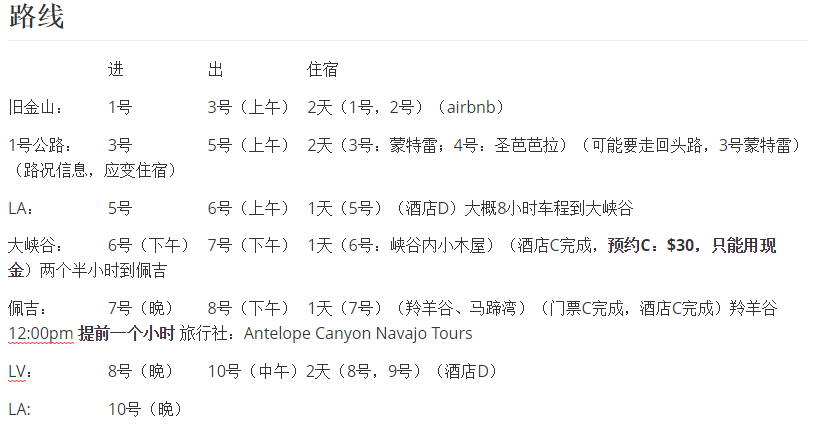
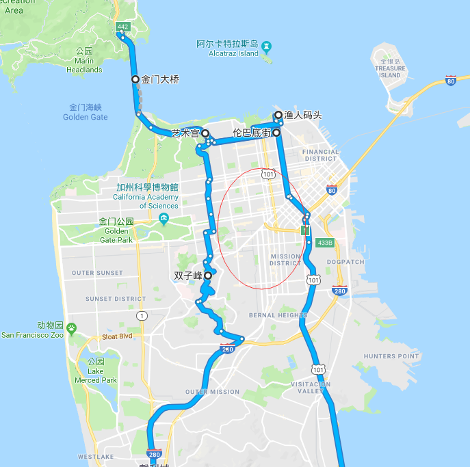
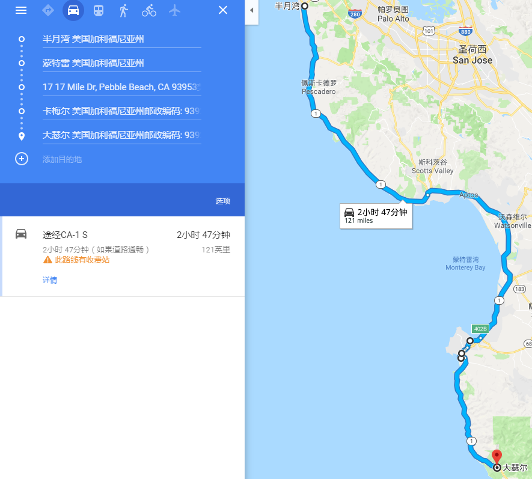
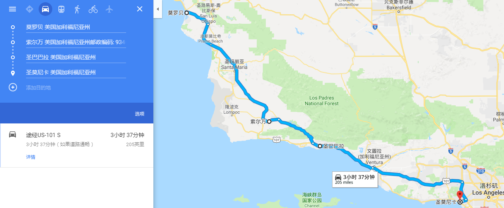
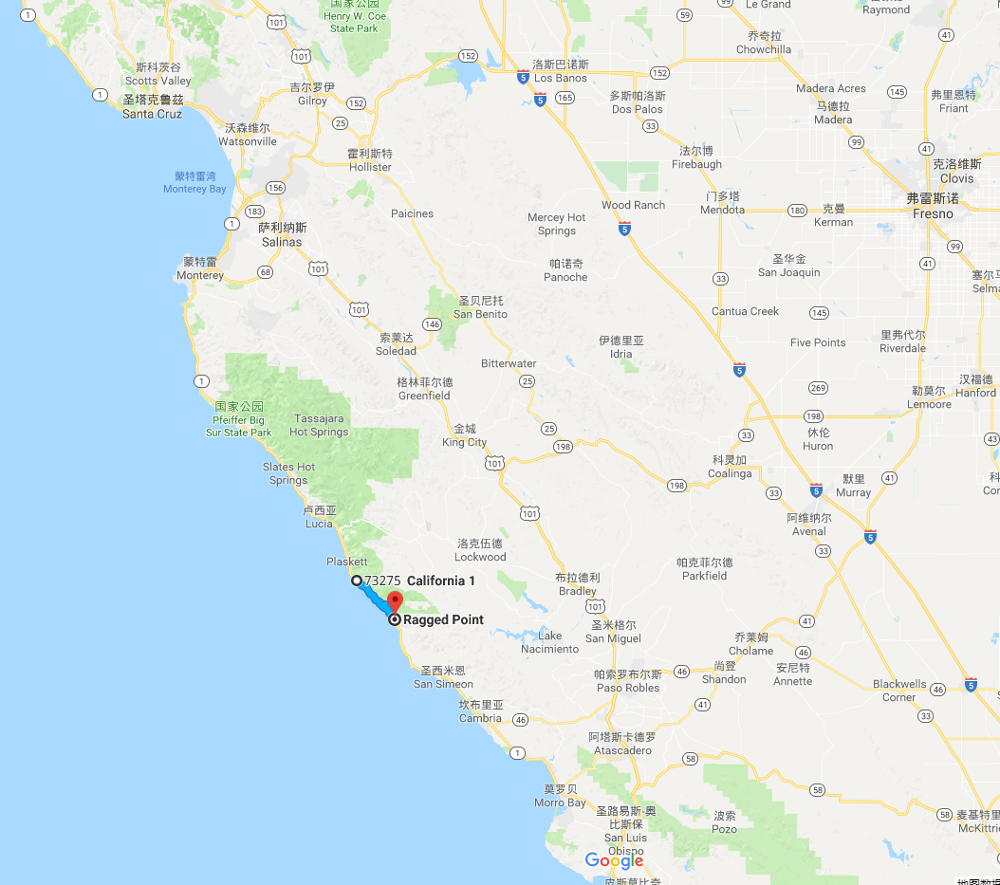
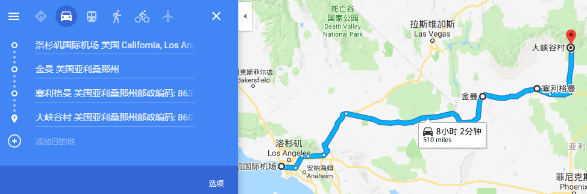
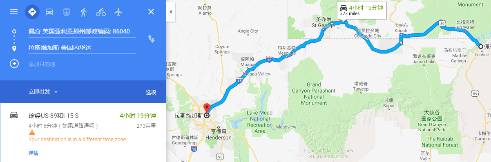
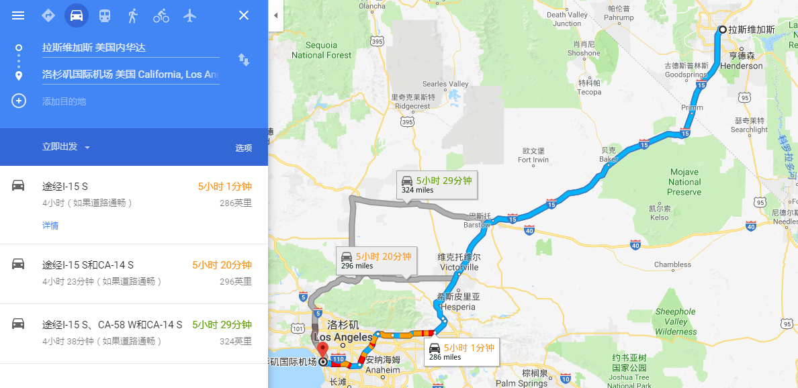

# 美西游

## 旧金山

鱼人码头，九曲花街，美国艺术宫，金门大桥，双子峰

1号晚：双子峰

2号上午：九曲花街，金门大桥，美国艺术宫，鱼人码头

2号下午：斯坦福，谷歌

## 1号公路

3号：如果有时间的话，加上赫氏古堡

4号：

路况查询：http://dot.ca.gov/cgi-bin/roads.cgi 

这一段可能不通：

参考游记： http://www.mafengwo.cn/wenda/detail-8450283.html 

推荐游点：半月湾Half Moon Bay；蒙特雷Monterrey；17英里-17 miles drive——Pacific Grove Gate（入）Carmel Gate（出）；卡梅尔小镇Carmel；大苏尔路段Big Sur（Pfeiffer Falls、Pfeiffer beach，加州1号风景最美最壮观的一段路，弯多路陡，车速开不快的）；

莫罗湾Morro Bay， 丹麦村Solvang，  圣巴巴拉Santa Barbara， 圣莫尼卡 Santa Monica

鸽点灯塔、Sam simeon（赫氏古堡）、坎布里亚

## 洛杉矶

5号：随便逛逛，入住：DoubleTree by Hilton Hotel LA - Commerce

6号：出发大峡谷

## 大峡谷及附近

6号晚入住：Bright Angel Lodge ，看日落（Yaki point ）

7号：看日出(Hopi point)，大峡谷内随便逛逛，下午出发Page

参考游记：http://www.mafengwo.cn/i/5524293.html

大峡谷官网：https://www.nps.gov/grca/index.htm

中文的：http://bbs.qyer.com/thread-765035-1.html

游览点：

Mather Point(位处于大峡谷南缘的马瑟点是峡谷内的最著名景点之一。从马瑟点眺望峡谷，视野极为宽广，将大峡谷壮观秀丽的景致尽收眼底。)

Yaki point ：最佳日落观景点

Hopi point：这里是欣赏日出的观景点

Grandview Point ：最佳视野观测点

Moran point: 如果你想静静的感受大峡谷的壮观，这个景点是最好的选择

Desert View:从大峡谷东侧入园的第一个景点

## Page

7号晚入住：Best Western Plus at Lake Powell

8号上午：马蹄湾（大坝），12点上羚羊谷（提前一个小时，注意时差）

下午：大坝，回LV

参考游记：http://www.mafengwo.cn/gonglve/ziyouxing/2036.html

羚羊谷订票： www.antelopeslotcanyon.com

游记：http://www.mafengwo.cn/i/5524293.html

Horseshoe Bend Observation Area（马蹄湾）：

Lower Antelope Canyon（下羚羊谷）：

Upper Antelope Canyon（上羚羊谷）：

## LV

8号入住：Tropicana Las Vegas - a DoubleTree by Hilton Hotel

9号：随便逛逛，买买买！！！

10号下午：回LA

## 路线

​			进			出			住宿

旧金山：		1号			3号（上午）	2天（1号，2号）（airbnb）

1号公路：	3号			5号（上午）	2天（3号：蒙特雷；4号：圣芭芭拉）（可能要走回头路，3号蒙特雷）								（路况信息，应变住宿）

LA：		5号			6号（上午）	1天（5号）（酒店D）大概8小时车程到大峡谷

大峡谷：		6号（下午）	7号（下午）	1天（6号：峡谷内小木屋）（酒店C完成，**预约C：$30，只能用现金**）两个半小时到佩吉

佩吉：		7号（晚）	8号（下午）	1天（7号）（羚羊谷、马蹄湾）（门票C完成，酒店C完成）羚羊谷12:00pm **提前一个小时** 旅行社：Antelope Canyon Navajo Tours

LV：		8号（晚）	10号（中午）2天（8号，9号）（酒店D）

LA:			10号（晚）

## TODO

9号酒店，1号2号airbnb，交通规则熟悉C，outlet优惠信息，1号公路路况C，6个泡面C，老干妈C，手机卡，换美金

打印：

酒店信息，保险信息，驾照翻译，大峡谷指南： https://www.nps.gov/grca/learn/news/upload/grca_simp-chinese.pdf

## DONE

大峡谷酒店预订：BRIGHT ANGEL LODGE： http://www.grandcanyonlodges.com/lodging/bright-angel/ 

page酒店预订

LA酒店预订（5）

LV酒店预订（8号）

羚羊谷预订（8号），旅行社：Antelope Canyon Navajo Tours 时间：March 8, 2018 12:00pm **提前一个小时**

订车：http://www.rentalcars.com， 

保险

驾照翻译C

## 到美国后

取车凭证：

主驾驶人名下的有效信用卡
您的驾照（本国驾照和国际驾照）

吃：yelp
